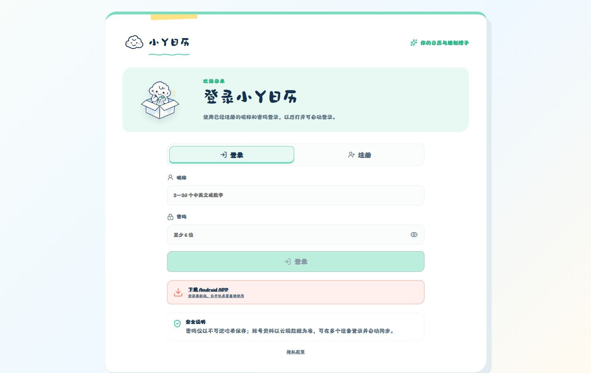
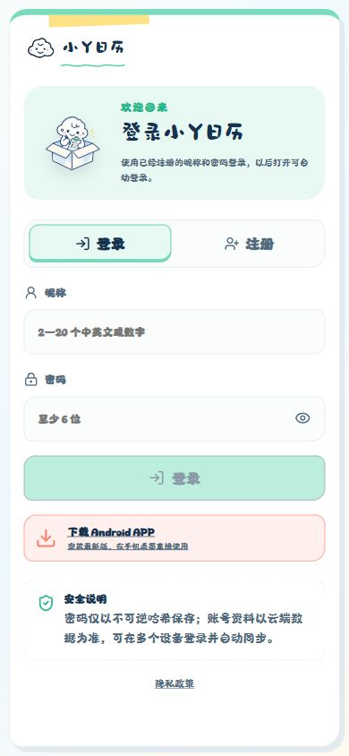

# 小Y日历

一个把日历、工期统计、便签、学习/工作规划和 AI 助手放在一起的可爱效率应用。支持网页、PWA 与 Android，登录后以云端数据为主进行多端同步，同时保留基础日历的本地可用能力。

[](https://calendar.yzzwnw.asia/)
[](https://calendar.yzzwnw.asia/downloads/xiaoy-calendar-1.9-109004.apk)

> 当前 Android 版本：**1.9**（versionCode 109004），支持 Android 7.0 及以上系统。

## 1.9 更新内容

- 新增主题设置中心，可在云朵体与跟随系统字体之间切换
- 支持前景内容透明度调节，背景壁纸保持独立显示
- 支持上传 JPG、PNG、WebP 壁纸，通过图像分析自动选择主体区域、适配横竖屏并提取界面配色
- 字体、透明度、内置主题、自定义壁纸和自适应配色随账号同步
- 小Y Agent 可以识别主题修改意图，并在用户确认后执行字体、皮肤和透明度操作
- 管理员后台新增“用户壁纸”，可查看用户上传的原图、文件格式、大小和上传时间
- 删除用户当前自定义皮肤时保留后台原图档案，避免审计记录丢失
- Android 版本升级为 1.9 / versionCode 109004，可可靠覆盖较早的正式签名版本

## 最新界面

<p align="center">
  
  
</p>

## 下载与体验

- 在线版：[https://calendar.yzzwnw.asia/](https://calendar.yzzwnw.asia/)
- Android APK：[从小Y日历官网下载最新版](https://calendar.yzzwnw.asia/downloads/xiaoy-calendar-1.9-109004.apk)
- 管理员入口：[https://calendar.yzzwnw.asia/admin/](https://calendar.yzzwnw.asia/admin/)

正式签名的 1.9 APK 可以直接覆盖较早的正式版本，账号、本地日历记录和应用数据会保留。若手机安装的是早期 Debug 包或其他签名版本，Android 会因签名不同而拒绝覆盖，需要先备份数据并卸载旧包。

## 主要功能

### 日历与工期

- 月历浏览、返回今天、快速切换与指定日期跳转
- 标记工作日、休息日、请假，并支持再次点击取消状态
- 设置每日工期，统计本月工作天数、请假天数和全部月份累计工期
- 选择任意日期区间查看总工期
- 展示农历、传统节日、国际节日、法定放假和调休上班标记
- 主题装扮支持云朵体、跟随系统字体、明暗配色与 AI 智能取景的自定义皮肤
- 主题设置随账号同步，适配桌面浏览器、PWA 和 Android WebView

### 便签、待办与每日任务

- 为任意日期添加、编辑、完成和删除便签/待办
- 有内容的日期会在日历右上角显示对应图标
- 每日任务可关联总规划，也可以单独添加、移动、调整或完成
- 日期详情集中管理当天状态、工期、任务和便签

### 学习规划与工作规划

- 创建学习规划或工作规划，设置目标、日期范围、执行星期和默认任务
- 总规划保持稳定，每日任务可以单独覆盖、增删和调整，不会影响其他日期
- 规划中心支持筛选、进度统计、编辑、删除和完成情况查看
- 规划任务自动映射到有效日期，并严格区分学习与工作类型

### 小Y Agent

- 根据目标、时间范围、已有日历和用户情况追问并生成可执行方案
- 支持流式回复、联网搜索、来源链接和多模型容错
- 生成规划草案，必须经用户确认后才会写入日历
- 可操作日期状态、工期、便签、任务、规划、主题与日历跳转
- 可打开个人资料设置；密码只在安全表单中修改，不交给模型处理
- 宠物支持拖拽、隐藏到屏幕侧边、调整聊天气泡尺寸和多种状态形象
- 断网时提示 Agent 需要联网，其余日历功能仍可继续使用

### 账号与云端同步

- 昵称和密码注册，昵称重复时会明确提示
- 注册成功自动登录，后续支持自动登录
- 普通用户可以修改自己的昵称和密码
- 网页与 APK 使用同一账号系统，日历、工期、便签、规划和 Agent 会话多端同步
- 普通用户会话与管理员会话相互独立，可以在同一浏览器同时登录

### 管理员后台

- 独立 `/admin/` 登录入口与管理员会话
- 按用户查看账号状态、注册时间、最近登录和最近活跃时间
- 用户搜索、排序、新增、修改、停用、重置密码与删除
- 查看每位用户的规划、日历数据概览、聊天记录、模型调用和行为记录
- 查看用户上传的壁纸原图、文件信息与历史上传状态；壁纸原图仅管理员可访问
- 查看模型提供商、响应耗时、成功率、登录设备和同步次数
- 桌面与手机端均提供适配布局

## 数据与隐私

- 密码经过不可逆哈希保存，服务端不会保存明文密码
- 登录后以云端数据为主实现多端同步，并保留必要的本地副本
- 只有使用 Agent 时，必要的对话内容和精简日历上下文才会发送给模型服务
- 联网搜索仅在 Agent 需要资料时调用，外部链接由系统浏览器打开
- API 密钥通过 Cloudflare 环境变量保存，不写入前端源码或仓库
- 用户壁纸原图分片保存在 D1，下载接口要求管理员会话；用户删除当前皮肤后仍保留后台档案
- 详细说明见：[隐私政策](https://calendar.yzzwnw.asia/privacy/)

## 技术栈

- React + Vite
- Capacitor Android
- Cloudflare Pages / Pages Functions
- Cloudflare D1
- Lucide React
- lunar-javascript

## 本地开发

需要 Node.js、npm。

```bash
npm install
npm run dev
```

构建网页：

```bash
npm run build
```

运行测试：

```bash
node --test tests/*.mjs
```

## Android 构建

需要 JDK、Android SDK，并准备与历史正式版一致的 JKS 签名文件。

```bash
npm run android:sync
```

构建正式 APK 与 AAB：

```powershell
powershell -ExecutionPolicy Bypass -File scripts/build-store-release.ps1
```

签名证书、密码和本地构建产物已被 `.gitignore` 排除，不应提交到仓库。应用升级必须保持 `applicationId` 和签名证书不变，并提升 `versionCode`。

## Cloudflare 部署

```bash
npm run build:cloudflare
npx wrangler pages deploy dist --project-name xiaoy-calendar --branch main
```

`build:cloudflare` 会把本地 `release/xiaoy-calendar-1.9-store.apk` 临时放入 `dist/downloads`。APK 不进入 Git 仓库，也不会被 Capacitor 打进 Android 安装包。D1 数据库绑定、模型密钥和搜索密钥应通过 Cloudflare 控制台或 Wrangler Secrets 配置。

## 项目结构

```text
src/                    React 前端、日历、规划、Agent 与管理员界面
functions/              Cloudflare Pages Functions API
migrations/             D1 数据库迁移
public/                  PWA、隐私政策与静态资源
android/                 Capacitor Android 工程
release/store-listing/   应用商店截图与上架资料
scripts/                 Android 正式版构建脚本
tests/                   日期、Agent 与会话相关测试
```

## 许可证

当前项目未声明开源许可证，默认保留所有权利。
