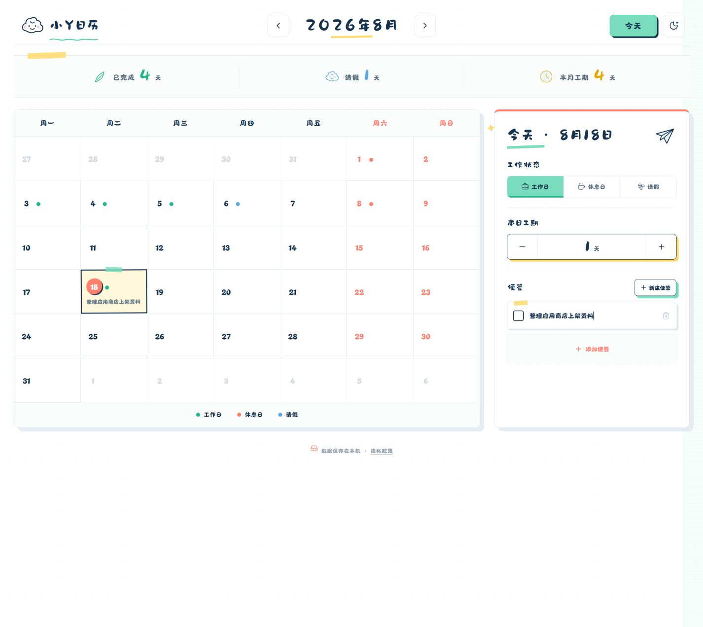

# 小Y日历

一款可爱、轻量的工期统计与便签日历。支持按天记录工作日、休息日和请假状态，并自动汇总当月数据；所有个人记录默认保存在本机。



## 功能特点

- 📅 月历浏览与快速切换月份
- 💼 标记工作日、休息日和请假
- ⏱️ 设置每日工期并自动统计
- 📝 为每天创建和管理便签
- 🌙 支持明暗主题切换
- 📱 适配桌面浏览器与手机屏幕
- 🔒 纯离线使用，数据保存在设备本地
- 📦 支持 PWA 与 Android APK/AAB 打包

## 在线体验

[https://calendar.yzzwnw.asia/](https://calendar.yzzwnw.asia/)

## 本地运行

请先安装 Node.js，然后执行：

```bash
npm install
npm run dev
```

浏览器访问终端显示的本地地址即可使用。

## 构建网页版本

```bash
npm run build
```

构建结果位于 `dist/` 目录，可部署到任意静态网站托管平台。

## 构建 Android 版本

构建前需要准备 Android SDK、JDK，并正确配置 Capacitor Android 环境。

生成调试 APK：

```bash
npm run android:apk
```

同步网页资源到 Android 工程：

```bash
npm run android:sync
```

签名发布包可使用：

```powershell
powershell -ExecutionPolicy Bypass -File scripts/build-store-release.ps1
```

> 签名脚本需要本机存在对应的 JKS 文件。签名证书、密码、APK、AAB 和其他发布产物不会提交到仓库。

## 数据与隐私

小Y日历不要求注册账号，不上传日历状态、工期或便签内容。清除浏览器数据或卸载应用前，请留意本地记录可能同时被删除。

## 技术栈

- React
- Vite
- Capacitor
- Lucide React

## 项目结构

```text
src/                    前端源码
public/                 PWA、隐私说明与静态资源
android/                Capacitor Android 工程
design/                 设计参考与应用图标
release/store-listing/  应用商店文案与截图
scripts/                Android 发布构建脚本
```

## 许可证

当前项目暂未声明开源许可证，默认保留所有权利。
